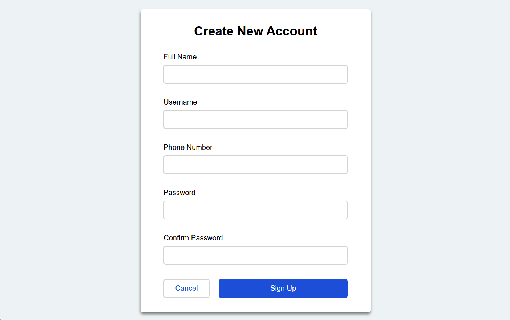
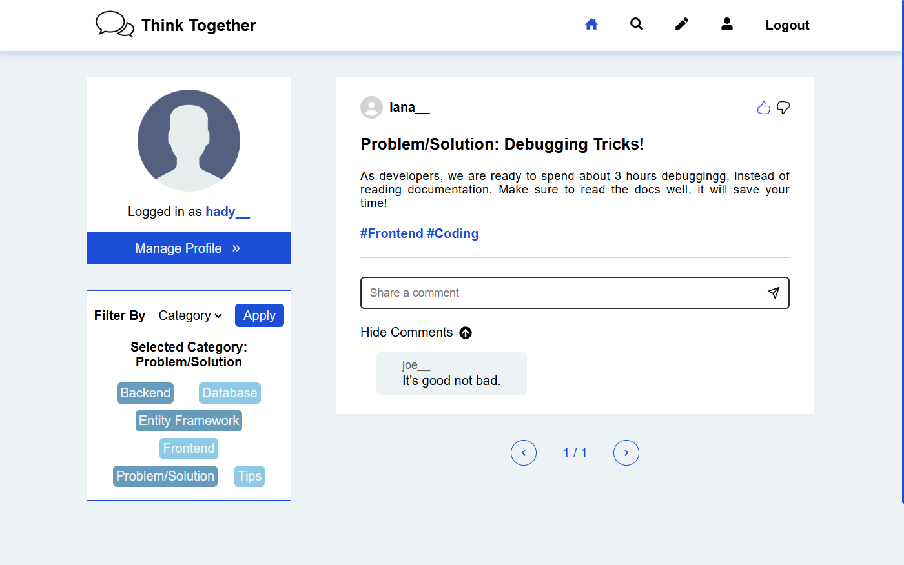
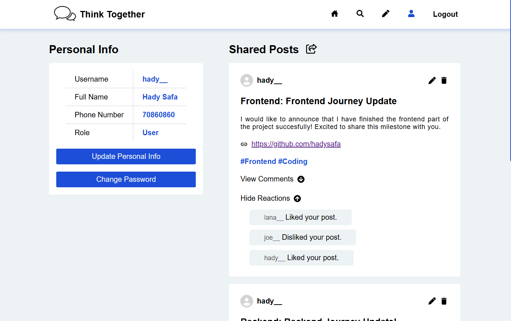

# Think Together

Think Together is a Community Knowledge Sharing Platform. It’s a user-friendly web application where anyone can share solutions to problems, innovative ideas, personal achievements, helpful tips, and more. The platform encourages interaction by allowing users to engage through comments, upvotes, and downvotes.
## Core Features

User Registration and Authentication

- Sign Up/Login: Allow users to register, login, and manage their profiles.
- Roles and Permissions: Basic roles like "User" and "Admin" to help moderate the platform.

Post Creation and Management

- Post Management: Users can Edit, Delete, and Submit new posts with an option to attach links or code snippets.
- Post Categories: Enable users to categorize their posts under categories or tags.

User Interaction

- Upvote/Downvote: Users can upvote or downvote posts.
- Comments: Allow users to leave comments on posts for additional insights, questions, or discussions.

Search and Filter Options

- Search Bar: Let users search posts by tags.
- Filters: Filter posts by categories or popularity (e.g., most upvoted).

Profile Management

- User Dashboard: A profile section where users can view their posts, comments and reactions history.

## Development Approach

This project uses an **API-driven architecture**.

- The backend serves RESTful APIs, providing endpoints for data interaction.

- The frontend communicates with the backend APIs to fetch, display, and manipulate data dynamically.

## Tech Stack

**Frontend:** ReactJs and Cascading-Style-Sheets (CSS)

**Version Control:** Git and Github

## Installation

Clone the Repository

```bash
  git clone https://github.com/HadySafa/ThinkTogether-Frontend
```
Install Dependencies

```bash
cd community-knowledge-sharing-platform
npm install react-router-dom 
npm install react-icons
 ```

Set Up the Backend

- Check out the [Backend Repository](https://github.com/HadySafa/ThinkTogether-Backend) and follow the steps.

Run the Application
```bash
cd community-knowledge-sharing-platform
npm run dev
 ```

 ## Note

The backend part of this project is in a separate repository. Make sure to [check it out here](https://github.com/HadySafa/ThinkTogether-Backend) for the complete application.

 ## Screenshots



